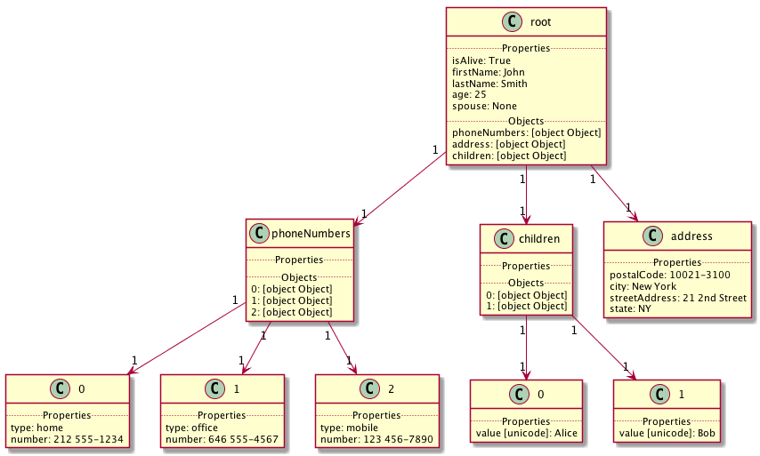

# dict2uml

 

Python library that prints a Python `dict` as PlantUML code or as an inline picture in a Jupyter Notebook.

Heavily inspired by [json-to-plantuml](https://github.com/meteorbites/json-to-plantuml) by [meteorbites](https://github.com/meteorbites) and [IPlantUML](https://github.com/jbn/IPlantUML) by [John B Nelson](https://github.com/jbn).

## Installation

Clone this repo, then do

~~~
python setup.py install
~~~

## Usage

This can be used either at command line or in a notebook. You can generate an SVG or print the code that generated the diagram.

~~~
import dict2uml
d = {"beers": ["Heineken","Budweiser","Guinness"]}
dict2uml.dict2svg(d)
print(dict2uml.dict2plantuml(d))
~~~

## Example

~~~
cat example.json | python dict2uml.py | plantuml -pipe | open -a Preview.app -f
~~~

 

Example source: Wikipedia contributors, "JSON," Wikipedia, The Free Encyclopedia, https://en.wikipedia.org/w/index.php?title=JSON&oldid=806502500 (accessed November 3, 2017).